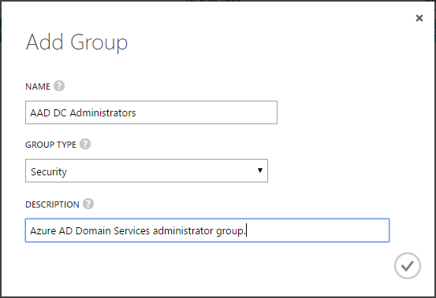
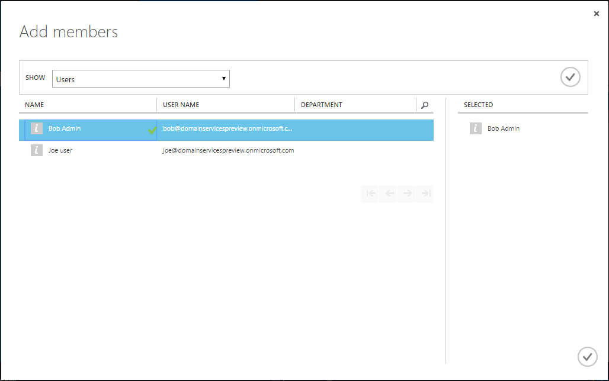

<properties
	pageTitle="Azure AD Domain Services: Create the AAD DC Administrators group | Microsoft Azure"
	description="Getting started with Azure Active Directory Domain Services"
	services="active-directory-ds"
	documentationCenter=""
	authors="mahesh-unnikrishnan"
	manager="stevenpo"
	editor="curtand"/>

<tags
	ms.service="active-directory-ds"
	ms.workload="identity"
	ms.tgt_pltfrm="na"
	ms.devlang="na"
	ms.topic="article"
	ms.date="09/21/2016"
	ms.author="maheshu"/>

# Get started with Azure AD Domain Services

This article walks through the configuration tasks required to enable Azure AD Domain Services for your Azure AD tenant.

## Task 1: Create the 'AAD DC Administrators' group
The first task is to create an administrative group in your Azure Active Directory tenant. This special administrative group is called **AAD DC Administrators**. Members of this group are granted administrative privileges on machines that are domain-joined to the Azure AD Domain Services managed domain. On domain-joined machines, this group is added to the ‘Administrators’ group. Additionally, members of this group can use Remote Desktop to connect remotely to domain-joined machines.  

> [AZURE.NOTE] You do not have Domain Administrator or Enterprise Administrator privileges on the managed domain created using Azure AD Domain Services. On managed domains, these privileges are reserved by the service and are not made available to users within the tenant. However, you can use the special administrator group created in this configuration task, to perform some privileged operations. These operations include joining computers to the domain, belonging to the Administrators group on domain-joined machines, configuring Group Policy etc.

In this configuration task, you create the administrative group and add one or more users in your directory to the group. Perform the following steps to create the administrative group for Azure AD Domain Services:

1. Navigate to the **Azure classic portal** ([https://manage.windowsazure.com](https://manage.windowsazure.com))

2. Select the **Active Directory** node on the left pane.

3. Select the Azure AD tenant (directory) for which you would like to enable Azure AD Domain Services. You can only create one domain for each Azure AD directory.

    

4. Click the **Groups** tab.

5. To add a group to your Azure AD tenant, click **Add Group** from the task pane at the bottom of the page.

6. Create a group named **AAD DC Administrators**.

    > [AZURE.WARNING] Create a group with this exact name to enable access within Azure AD Domain Services.

	

7. Add a description for this group so others understand that this group is used to grant administrative privileges within Azure AD Domain Services.

8. After the group has been created, click the name of the group to see the properties of this group. To add users as members of this group, click the **Add members** button on the bottom panel.

9. In the **Add members** dialog, select the users who should be members of this group and select the checkbox when you are done.

    

 

## Task 2: Create or select an Azure virtual network
The next configuration task is to [create or select an Azure virtual network](active-directory-ds-getting-started-vnet.md).
